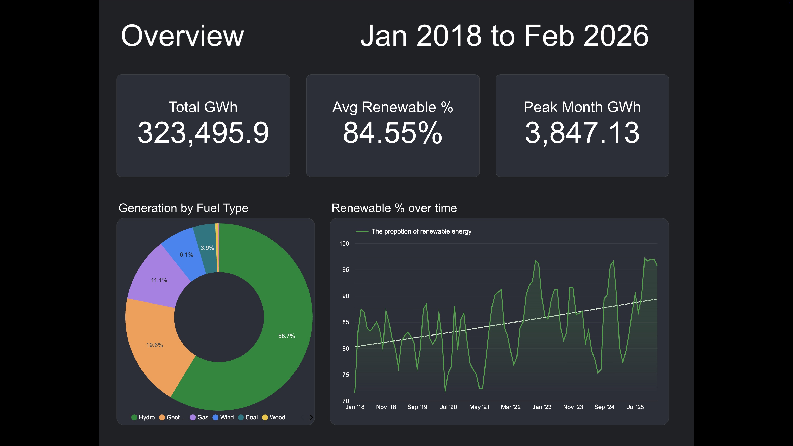
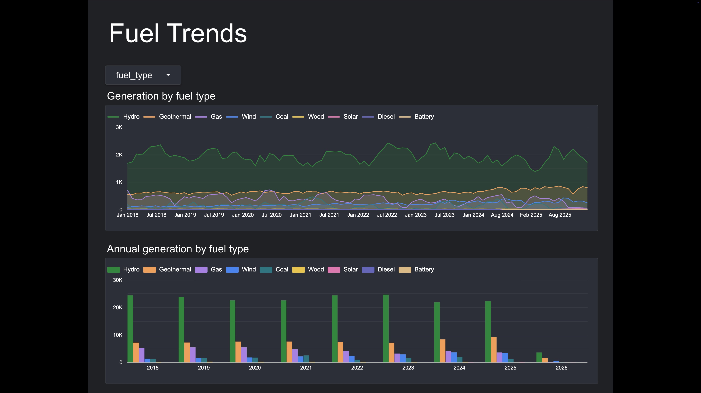
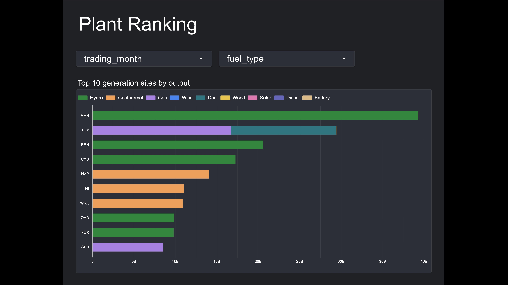
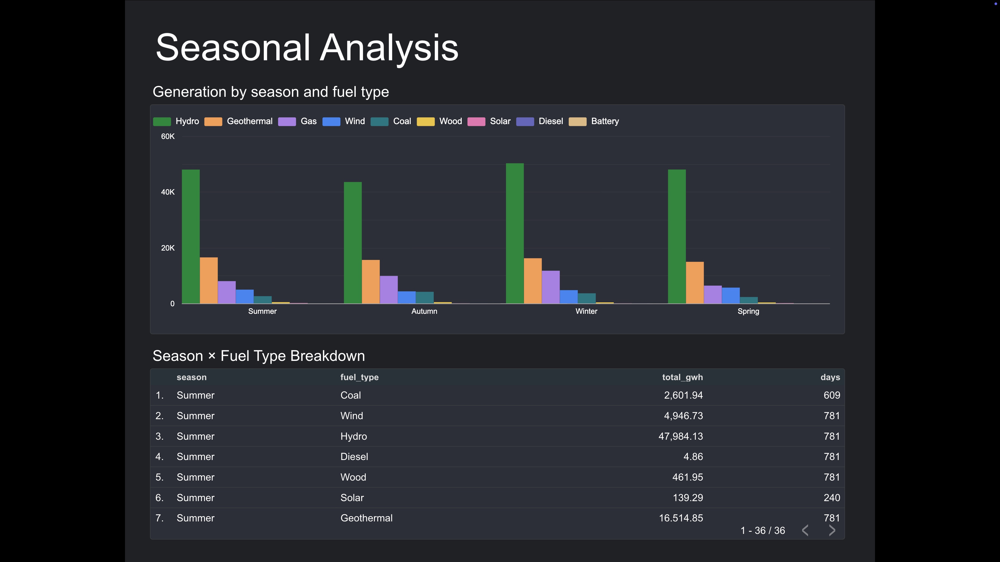
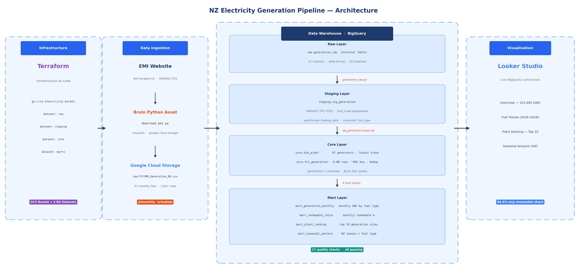

# NZ Electricity Generation Pipeline


An end-to-end **batch data pipeline** built with [Bruin](https://bruin-data.github.io/bruin/) that ingests monthly NZ electricity generation data from the Electricity Authority (EMI), unpivots wide-format CSVs in BigQuery, models generation trends by fuel type, and visualises New Zealand's energy transition in Looker Studio.

**Data coverage:** Jan 2018 – Feb 2026 · **97 monthly files** · **11M+ rows**

---

## Dashboard

> [View Live Dashboard →](https://lookerstudio.google.com/reporting/8b353360-0f66-40ce-9653-e6ab9fda1139)

### Overview — 323,495 GWh | Avg 84.6% Renewable


### Fuel Trends — Monthly generation by fuel type (2018–2026)


### Plant Ranking — Top 10 generation sites by total output


### Seasonal Analysis — NZ Southern Hemisphere seasons


---

## Key Findings

- **84.6% average renewable share** (2018–2026), with an upward trend driven by Wind growth
- **Hydro dominates** at 58.7% of total generation; Manapouri (MAN) is the single largest site
- **Coal in decline**: Huntly (HLY) coal generation visibly shrinking year-over-year
- **Winter peaks**: Hydro generation highest in winter months due to NZ's snowmelt patterns
- **Wind acceleration**: Wind generation roughly doubled from 2018 to 2026

---

## Architecture



---

## Tech Stack

| Layer | Tool |
|---|---|
| Infrastructure | Terraform (GCS bucket + 4 BQ datasets + billing budget) |
| Ingestion | Bruin Python asset (`requests` + `google-cloud-storage`) |
| Storage | Google Cloud Storage (CSV files) + BigQuery External Table |
| Transformation | Bruin SQL assets (BigQuery UNPIVOT, window functions, MD5 keys) |
| Quality Checks | Bruin built-in checks (not_null, unique, non_negative, accepted_values, min/max) + custom SQL checks |
| Orchestration | Bruin pipeline (`schedule: @monthly`) |
| Visualisation | Looker Studio (native BigQuery connector) |

### Why Bruin?

Bruin replaces **Airflow + dbt + Great Expectations** with a single tool and CLI:

```bash
# One command runs ingestion + transformation + quality checks
bruin run . --start-date 2018-01-01 --end-date 2026-02-28
```

No Docker Compose. No separate profile files. No extra package installations.

---

## Data Source

| Field | Value |
|---|---|
| Source | [EMI — Electricity Authority NZ](https://www.emi.ea.govt.nz/Wholesale/Datasets/Generation/Generation_MD) |
| Format | CSV (wide format, 57 columns: Site_Code, Gen_Code, Fuel_Code, Trading_Date, TP1–TP50) |
| Update frequency | Monthly (published ~10th of following month) |
| Coverage | Jan 2018 – present |
| Key challenge | TP1–TP50 columns require UNPIVOT; Fuel_Code values are non-standard and need mapping |

---

## Project Structure

```
.
├── .bruin.yml                          # Bruin environment + GCP connection (ADC)
├── pipeline.yml                        # Schedule: @monthly, start_date: 2018-01-01
├── policy.yml                          # Global quality check policy
├── requirements.txt                    # Python deps (requests, google-cloud-*)
├── assets/
│   ├── raw/
│   │   ├── download_emi.py             # Download monthly CSV → GCS
│   │   └── generation_raw.py           # Create BQ external table
│   ├── staging/
│   │   └── stg_generation.asset.sql    # UNPIVOT + standardise (10 quality checks)
│   ├── core/
│   │   ├── dim_plant.asset.sql         # Generator dimension (latest state)
│   │   └── fct_generation.asset.sql    # Fact table (partitioned + clustered)
│   └── marts/
│       ├── mart_generation_monthly.asset.sql
│       ├── mart_renewable_ratio.asset.sql
│       ├── mart_plant_ranking.asset.sql
│       └── mart_seasonal_pattern.asset.sql
├── terraform/
│   ├── main.tf                         # GCS bucket, 4 BQ datasets, billing budget
│   ├── variables.tf
│   ├── outputs.tf
│   └── terraform.tfvars.example
├── scripts/
│   └── monthly_refresh.sh              # Local cron script for monthly updates
└── images/
    └── dashboard/                      # Dashboard screenshots
```

---

## Quality Checks

Bruin's built-in quality checks run automatically after each asset materialises:

| Asset | Checks |
|---|---|
| `stg_generation` | `not_null` (trading_date, gen_code, fuel_type, generation_kwh) · `min/max` (trading_period: 1–50) · `accepted_values` (9 fuel types) · `non_negative` (generation_kwh) · custom row count ≥ 1000 |
| `fct_generation` | `not_null + unique` (generation_id) · `non_negative` (generation_kwh) |
| `dim_plant` | `not_null + unique` (gen_code) · `not_null` (site_code, fuel_type) |

**Total: 17 quality checks** across the pipeline, all passing on full dataset.

---

## Quick Start

### Prerequisites

- [Bruin CLI](https://bruin-data.github.io/bruin/getting-started/installation.html)
- GCP account with BigQuery + GCS enabled
- Terraform
- `gcloud auth application-default login`

### Setup

```bash
# 1. Clone the repo
git clone <repo-url>
cd DE-zoomcamp-capstone-project

# 2. Configure environment
cp terraform/terraform.tfvars.example terraform/terraform.tfvars
# Edit terraform.tfvars with your project_id, bucket_name, billing_account

# 3. Create GCP resources
cd terraform && terraform init && terraform apply
cd ..

# 4. Set environment variables
cat > .env << 'EOF'
GCP_PROJECT_ID=your-project-id
GCS_BUCKET_NAME=your-bucket-name
EOF

# 5. Run the full pipeline (backfill 2018–present)
set -a && source .env && set +a
bruin run . --start-date 2018-01-01 --end-date 2026-02-28
```

### Monthly Updates

A cron script is provided for automated monthly refreshes:

```bash
# Add to crontab (runs on 5th of each month at 08:00)
crontab -e
# Add: 0 8 5 * * /path/to/project/scripts/monthly_refresh.sh >> /path/to/project/logs/monthly_refresh.log 2>&1
```

---

## BigQuery Data Model

```
staging.stg_generation          raw.generation_raw (External)
    ↓ (UNPIVOT + standardise)       ↓ (GCS CSV files)
core.fct_generation  ←──────────────┘
core.dim_plant       ←── staging.stg_generation

marts.mart_generation_monthly  ←── core.fct_generation
marts.mart_renewable_ratio     ←── core.fct_generation
marts.mart_plant_ranking       ←── core.fct_generation
marts.mart_seasonal_pattern    ←── core.fct_generation
```

**Partitioning:** `fct_generation` and `stg_generation` partitioned by `trading_date`
**Clustering:** both tables clustered by `fuel_type` for efficient fuel-type queries

---

## Zoomcamp Evaluation Criteria

| Dimension | Implementation |
|---|---|
| Problem description | 4 business questions answered with 8-year NZ energy dataset |
| Cloud | GCP (BigQuery + GCS) with Terraform IaC including billing budget alert |
| Data ingestion (Batch) | Bruin Python asset downloads monthly CSVs + `@monthly` pipeline schedule |
| Data warehouse | BigQuery with partition (trading_date) + clustering (fuel_type) on fact table |
| Transformations | 4-layer pipeline: raw → staging → core → marts, all via Bruin SQL assets |
| Dashboard | Looker Studio, 4 pages, live BigQuery connection |
| Reproducibility | `.env` + `terraform.tfvars.example` + single `bruin run` command |
